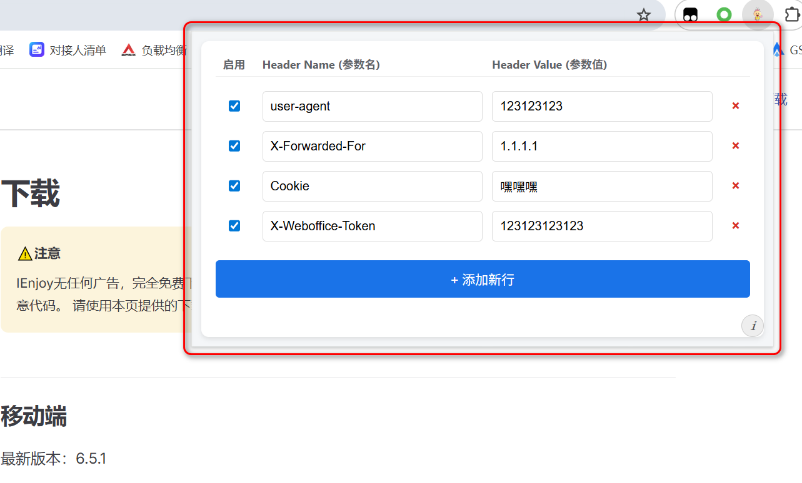
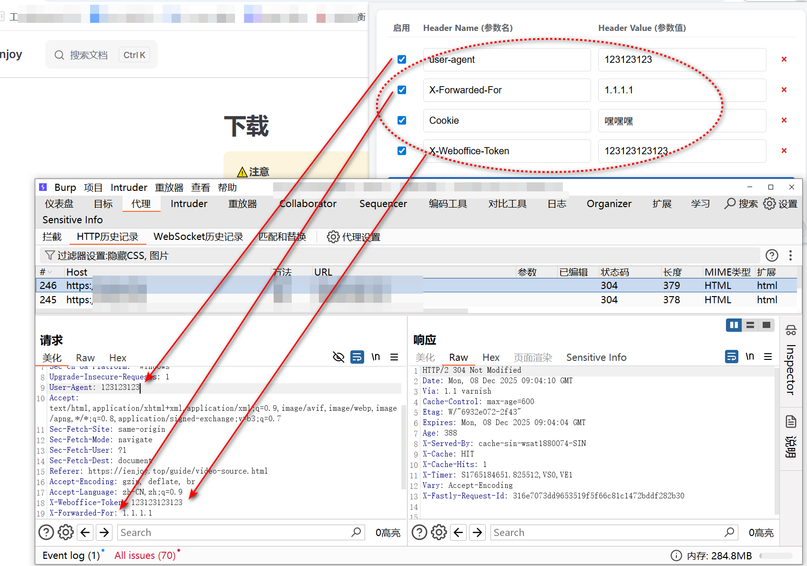

    经常需要调试修改http request header，然后发现chrome好多都真的特别不好用，好用的还各种带广告，要么偷偷加统计。没办法，最终自己靠笨拙的技术外加GPT做出来这个Chrom插件。

    具体使用方法：
    
1、将上述文件放到同一目录（例如 custom-header-modifier/）。

2、打开 Chrome，访问：chrome://extensions/

3、右上角打开“开发者模式”。

4、点击“加载已解压的扩展程序”，选择该目录。

5、安装后，点击工具栏上的扩展图标 → 打开“Simple Header Editor”。

6、然后就可以自由的添加规则了，如下图所示，程序会自动保存。

  
插件如下图：
  

--------------------

